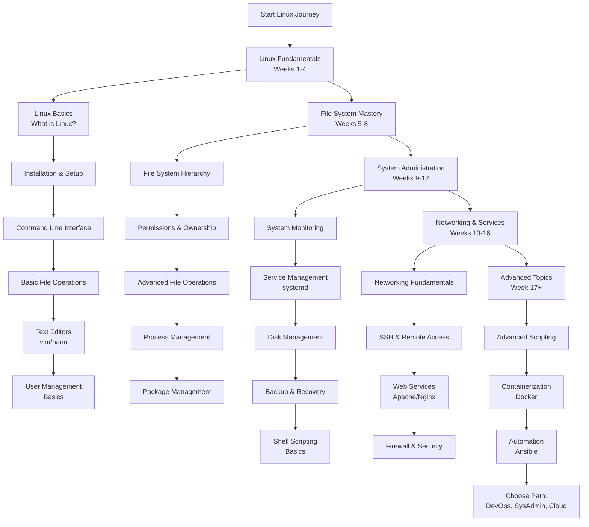

# Linux Mastery Path: A Comprehensive Learning Curriculum

This structured roadmap provides a systematic approach to mastering Linux system administration and command-line proficiency. The curriculum is designed sequentially, with each module building upon previous knowledge to ensure a solid foundation and progressive skill development.

---

## Phase 1: Linux Fundamentals & Basics (Weeks 1-4)

*   [**Module 1: Introduction to Linux**](https://github.com/ahmadrizal1st/linux-introduction/#readme)
    *   Linux Overview: History, Philosophy, and Key Characteristics (Open Source, UNIX-like)
    *   Understanding Linux Distributions: Ubuntu, CentOS, Debian, Red Hat
    *   Linux Kernel vs. Operating System Components
    *   Free Software Foundation and GNU Project
    *   Choosing the Right Distribution for Your Needs

*   [**Module 2: Installation & Environment Setup**](https://github.com/ahmadrizal1st/linux-installation/#readme)
    *   Installation Methods: Dual Boot, Virtual Machines (VirtualBox/VMware), Cloud Instances
    *   Partitioning Schemes and Filesystem Choices (ext4, XFS, Btrfs)
    *   Basic System Configuration During Installation
    *   Post-Installation Setup and Updates
    *   Introduction to Desktop Environments (GNOME, KDE, XFCE)

*   [**Module 3: Command Line Interface Basics**](https://github.com/ahmadrizal1st/linux-cli-basics/#readme)
    *   Terminal vs. Console: Understanding the Interface
    *   Shell Types: bash, zsh, fish (Focus on bash)
    *   Basic Command Structure: `command [options] [arguments]`
    *   Essential Navigation: `pwd`, `ls`, `cd`, `clear`
    *   Command History and Tab Completion

*   [**Module 4: Basic File Operations**](https://github.com/ahmadrizal1st/linux-file-operations/#readme)
    *   File System Navigation Commands
    *   File Operations: `cp`, `mv`, `rm`, `touch`, `mkdir`
    *   Viewing File Contents: `cat`, `less`, `more`, `head`, `tail`
    *   Finding Files: `find`, `locate`, `which`
    *   Wildcards and Pattern Matching: `*`, `?`, `[]`

*   [**Module 5: Text Editors**](https://github.com/ahmadrizal1st/linux-text-editors/#readme)
    *   **vim:** Modes (Normal, Insert, Visual), Basic Navigation, Saving/Exiting
    *   **nano:** Simple Text Editing for Beginners
    *   Basic Editing Operations in Both Editors
    *   When to Use Each Editor Appropriately

*   [**Module 6: User Management Basics**](https://github.com/ahmadrizal1st/linux-user-management/#readme)
    *   Understanding Users and Groups
    *   `sudo` and Superuser Privileges
    *   Basic User Operations: `useradd`, `usermod`, `userdel`
    *   Group Management: `groupadd`, `groupmod`, `groupdel`
    *   Switching Users: `su` command

---

## Phase 2: File System Mastery & Process Management (Weeks 5-8)

*   [**Module 7: Linux File System Hierarchy**](https://github.com/ahmadrizal1st/linux-filesystem/#readme)
    *   Standard Directory Structure: `/bin`, `/etc`, `/home`, `/var`, `/usr`
    *   Special Directories: `/dev`, `/proc`, `/sys`
    *   File Types: Regular Files, Directories, Links, Devices
    *   Hard Links vs. Soft Links: Creation and Differences
    *   Filesystem Types and Characteristics

*   [**Module 8: Permissions and Ownership**](https://github.com/ahmadrizal1st/linux-permissions/#readme)
    *   Understanding Permission Classes: User, Group, Others
    *   Permission Types: Read, Write, Execute
    *   Changing Permissions: `chmod` (Symbolic and Numeric)
    *   Changing Ownership: `chown`, `chgrp`
    *   Special Permissions: SUID, SGID, Sticky Bit

*   [**Module 9: Advanced File Operations**](https://github.com/ahmadrizal1st/linux-advanced-files/#readme)
    *   File Compression: `gzip`, `bzip2`, `xz`
    *   Archiving: `tar` with Various Options
    *   File Comparison: `diff`, `cmp`
    *   Text Processing: `grep`, `sed`, `awk` basics
    *   Input/Output Redirection: `>`, `>>`, `<`, `|`

*   [**Module 10: Process Management**](https://github.com/ahmadrizal1st/linux-processes/#readme)
    *   Understanding Processes and Threads
    *   Process Monitoring: `ps`, `top`, `htop`
    *   Process Control: `kill`, `killall`, `pkill`
    *   Job Control: Background (`&`), `fg`, `bg`, `jobs`
    *   Process Priority: `nice`, `renice`

*   [**Module 11: Package Management**](https://github.com/ahmadrizal1st/linux-packages/#readme)
    *   Debian-based Systems: `apt`, `apt-get`, `dpkg`
    *   Red Hat-based Systems: `yum`, `dnf`, `rpm`
    *   Package Searching, Installation, and Removal
    *   Repository Management and Configuration
    *   Compiling from Source: `./configure`, `make`, `make install`

---

## Phase 3: System Administration Essentials (Weeks 9-12)

*   [**Module 12: System Monitoring & Performance**](https://github.com/ahmadrizal1st/linux-monitoring/#readme)
    *   System Resource Monitoring: `free`, `vmstat`, `iostat`
    *   Disk Usage Analysis: `df`, `du`
    *   Log File Analysis: `/var/log` directory, `journalctl`
    *   System Uptime and Load Averages
    *   Real-time Monitoring Tools

*   [**Module 13: Service Management with systemd**](https://github.com/ahmadrizal1st/linux-services/#readme)
    *   Understanding systemd and init Systems
    *   Service Management: `systemctl start|stop|restart|status`
    *   Service Enablement: `systemctl enable|disable`
    *   Target Management and Runlevels
    *   Creating Custom systemd Services

*   [**Module 14: Disk Management & Partitioning**](https://github.com/ahmadrizal1st/linux-disks/#readme)
    *   Disk Partitioning: `fdisk`, `parted`
    *   Filesystem Creation: `mkfs`, `mkswap`
    *   Mounting Filesystems: `mount`, `umount`, `/etc/fstab`
    *   Logical Volume Management (LVM) Basics
    *   Disk Quotas and Limitations

*   [**Module 15: Backup and Recovery**](https://github.com/ahmadrizal1st/linux-backup/#readme)
    *   Backup Strategies: Full, Incremental, Differential
    *   Backup Tools: `rsync`, `tar`, `dd`
    *   Automated Backup with `cron`
    *   Disaster Recovery Planning
    *   System Cloning and Imaging

*   [**Module 16: Shell Scripting Fundamentals**](https://github.com/ahmadrizal1st/linux-scripting/#readme)
    *   Script Shebang and Basic Structure
    *   Variables and Data Types
    *   Control Structures: if-else, loops, case statements
    *   Functions and Parameter Handling
    *   Script Debugging and Best Practices

---

## Phase 4: Networking & Services (Weeks 13-16)

*   [**Module 17: Networking Fundamentals**](https://github.com/ahmadrizal1st/linux-basics/#readme)
    *   TCP/IP Protocol Suite Overview
    *   Network Configuration: `ip`, `ifconfig`, `route`
    *   Network Troubleshooting: `ping`, `traceroute`, `netstat`, `ss`
    *   DNS Configuration and Troubleshooting
    *   Network Interface Bonding and Teaming

*   [**Module 18: SSH & Remote Access**](https://github.com/ahmadrizal1st/linux-ssh/#readme)
    *   SSH Protocol and Encryption
    *   SSH Client Usage: `ssh`, `scp`, `sftp`
    *   SSH Server Configuration
    *   Key-based Authentication Setup
    *   SSH Tunneling and Port Forwarding

*   [**Module 19: Web Services**](https://github.com/ahmadrizal1st/linux-webservices/#readme)
    *   Apache HTTP Server Installation and Configuration
    *   Nginx Web Server Basics
    *   Virtual Host Configuration
    *   SSL/TLS Certificate Setup with Let's Encrypt
    *   Basic Web Application Deployment

*   [**Module 20: Firewall & Security**](https://github.com/ahmadrizal1st/linux-security/#readme)
    *   **iptables** Fundamentals: Chains, Rules, Policies
    *   **firewalld** Configuration (Red Hat-based)
    *   **UFW** Simplified Firewall (Debian-based)
    *   SELinux/AppArmor Basics
    *   Security Best Practices and Hardening

---

## Phase 5: Advanced Topics & Specialization

*   [**Module 21: Advanced Shell Scripting**](https://github.com/ahmadrizal1st/linux-scripting/#readme)
    *   Advanced Variable Manipulation
    *   Regular Expressions with `grep` and `sed`
    *   Advanced Text Processing with `awk`
    *   Error Handling and Logging
    *   Script Optimization and Portability

*   [**Module 22: Containerization with Docker**](https://github.com/ahmadrizal1st/linux-docker/#readme)
    *   Containerization Concepts vs. Virtualization
    *   Docker Installation and Configuration
    *   Container Lifecycle Management
    *   Dockerfile Creation and Best Practices
    *   Docker Compose for Multi-Container Applications

*   [**Module 23: Automation with Ansible**](https://github.com/ahmadrizal1st/linux-ansible/#readme)
    *   Infrastructure as Code Concepts
    *   Ansible Architecture: Control Nodes and Managed Nodes
    *   Playbook Creation and Execution
    *   Inventory Management
    *   Roles and Modules for Common Tasks

*   [**Module 24: Capstone Project & Career Specialization**](https://github.com/ahmadrizal1st/linux-capstone/#readme)
    *   **Deploy a Complete LAMP/LEMP Stack**
    *   **Implement Automated Backup Solution**
    *   **Create System Monitoring Dashboard**
    *   **Select a Specialization Path:**
        *   **DevOps Engineer:** CI/CD Pipelines, Infrastructure as Code, Cloud Platforms
        *   **System Administrator:** Enterprise Infrastructure, High Availability, Storage Systems
        *   **Cloud Engineer:** AWS, Azure, GCP Services, Kubernetes Orchestration
        *   **Security Specialist:** Penetration Testing, Security Auditing, Compliance

---

## Additional Resources

*   **Practice Environments:** Linux playgrounds, Docker containers for safe experimentation
*   **Community Forums:** Stack Overflow, Reddit's r/linuxadmin, Linux-specific forums
*   **Certification Paths:** LFCS (Linux Foundation Certified System Administrator), RHCSA (Red Hat)
*   **Continuous Learning:** Follow Linux news, security updates, and new technologies

This curriculum provides a comprehensive path from Linux beginner to advanced practitioner. Remember that mastery comes with consistent practice and real-world application.
